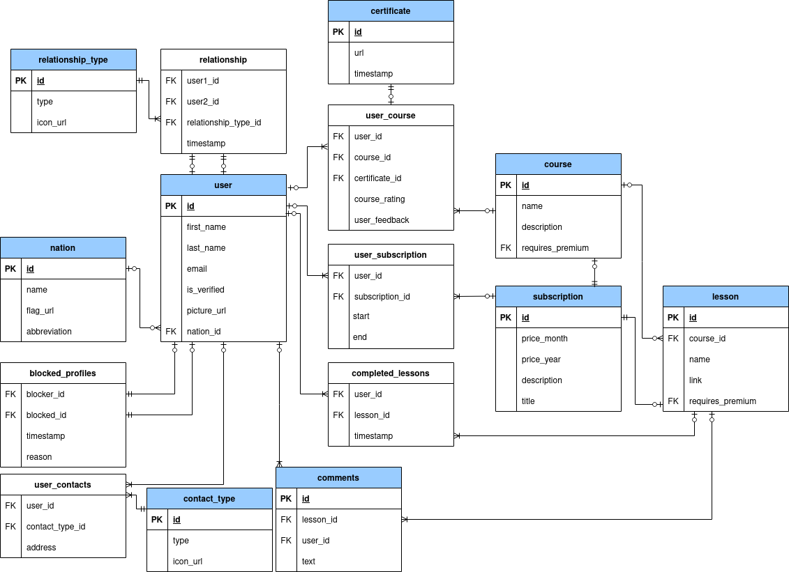

# Projekt z předmětu BPC-BDS
Tento repozitář slouží jako součást k odevzdání projektu z Bezpečnosti databázových systémů. Obsahuje složky obsahující skripty k PostgreSQL a MySQL a E-R diagram databáze ve formátu `pdf`. Ve složce k Postgre se nacházejí Python randomizéry, soubory `create.sql`, `fill.sql` a `final_fill.sql`, který je hotovou verzí `fill.sql` s randomizovanými položkami. Tímto souborem nakonec byla výsledná databáze plněná.
Schéma databáze
---------------
 
